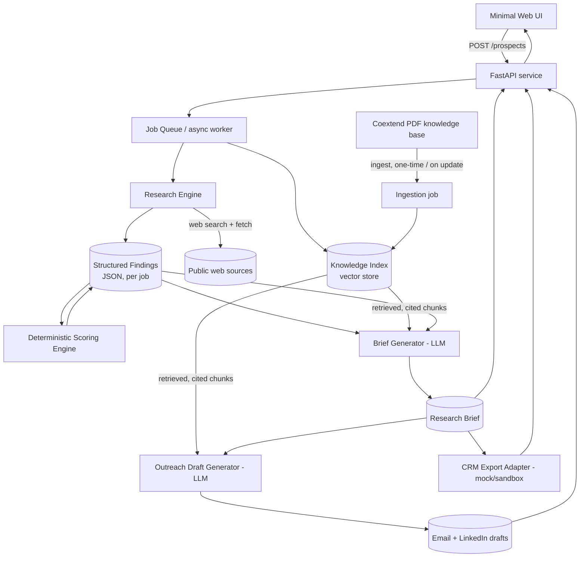

# Design Document — Coextend Prospect Intelligence MVP

## Overview

The system turns `{company name, website, optional contact}` into a scored,
cited, founder-ready research brief plus a CRM-ready export and optional
outreach drafts — in one asynchronous pipeline per prospect. It deliberately
keeps two knowledge sources separate end-to-end:

- **External Research Engine** — live web findings about *this* prospect.
- **Internal Knowledge Layer (RAG)** — Coextend's own PDFs, ingested once,
  retrieved with citations whenever the system needs to talk about Coextend's
  services, ICP, scoring rubric, or message templates.

Scoring is deterministic code, not an LLM guess — the LLM's job is
extraction/summarization/drafting; a plain scoring function's job is the number.

## Architecture



### Component boundaries (why they're separate)

| Component | Responsibility | Must NOT do |
|---|---|---|
| Research Engine | Fetches/searches the public web for *this* prospect; extracts structured findings with source URLs | Answer questions about Coextend's own services |
| Ingestion job | Chunks + embeds the Coextend PDFs into the Knowledge Index | Run per-prospect; it runs on deploy / on document update |
| Knowledge Index (RAG) | Retrieves cited Coextend-knowledge chunks (services, ICP, rubric text, templates, message libraries) | Store prospect-specific findings |
| Scoring Engine | Deterministic 0–100 score + breakdown from structured findings | Ask an LLM to produce the number |
| Brief Generator | Assembles the Research Output Template sections from findings + score + retrieved internal knowledge, with evidence labels | Invent facts not present in findings or retrieval |
| Outreach Draft Generator | Fills message-library templates with Verified/Probable findings | Send or schedule anything |
| CRM Export Adapter | Maps a completed brief to HubSpot-style JSON/CSV, written to a mock/sandbox store | Write to a live CRM in this MVP |
| API / UI | Job lifecycle, status, retrieval, download | Contain business logic (keep it thin) |

## Tech Stack (suggested — a Kiro coding agent may substitute equivalents)

- **Backend:** Python, FastAPI, Pydantic v2 for schemas
- **Async jobs:** simple in-process task queue for MVP (e.g., `asyncio` + a
  lightweight job table); swappable for Celery/RQ later
- **LLM calls:** structured-output mode (JSON schema-constrained) for
  extraction, brief assembly, and drafting
- **Retrieval:** any embeddings model + a lightweight vector store (e.g.,
  Chroma/FAISS) — file-based is fine for MVP scale
- **Web research:** a web search tool + a page-fetch/extract step (HTML → text)
- **Storage:** SQLite (or Postgres) for jobs/findings/briefs; local filesystem
  or object storage for ingested PDFs and generated exports
- **UI:** a single-page minimal frontend (or server-rendered form) — not the
  focus of the MVP; functional over polished
- **Secrets:** `.env` / OS environment variables, never committed

## Data Models

```python
class ProspectRequest(BaseModel):
    company_name: str
    website: HttpUrl
    known_contact_name: str | None = None
    known_contact_title: str | None = None

class SourceRef(BaseModel):
    url: HttpUrl
    title: str | None = None
    date_reviewed: date | None = None

class EvidenceLabel(str, Enum):
    VERIFIED = "Verified"
    PROBABLE = "Probable"
    UNVERIFIED = "Unverified"

class Finding(BaseModel):
    field: str                 # e.g. "company_size", "decision_maker", "project"
    value: str
    label: EvidenceLabel
    sources: list[SourceRef]

class ResearchFindings(BaseModel):
    job_id: str
    company_snapshot: list[Finding]
    decision_makers: list[Finding]
    projects_signals: list[Finding]
    notes_missing: list[str]    # explicit "no evidence found" entries

class ScoreFactor(BaseModel):
    factor: str
    weight: int
    points_awarded: int
    evidence: str

class LeadScore(BaseModel):
    rubric_version: str
    total: int                 # 0-100
    band: Literal["High", "Medium", "Low"]
    breakdown: list[ScoreFactor]

class ResearchBrief(BaseModel):
    job_id: str
    snapshot: dict
    contact: dict
    company_research: dict
    projects_signals: list[Finding]
    likely_requirements: list[Finding]
    pain_point_hypotheses: list[Finding]
    lead_score: LeadScore
    recommended_approach: dict
    risks_unknowns: list[str]
    next_action: dict
    sources: list[SourceRef]

class OutreachDrafts(BaseModel):
    job_id: str
    email_subject: str
    email_body: str
    linkedin_message: str
    status: Literal["draft"] = "draft"

class CRMExportRecord(BaseModel):
    job_id: str
    company_fields: dict        # HubSpot-style company properties
    contact_fields: dict
    deal_fields: dict
    lead_score_total: int
    lead_score_band: str
    possible_duplicate: bool
```

## API Surface

| Method | Path | Purpose |
|---|---|---|
| POST | `/prospects` | Create a research job (Req. 1) |
| GET | `/prospects/{job_id}` | Job status + summary |
| GET | `/prospects/{job_id}/brief` | Completed research brief (Req. 5) |
| GET | `/prospects/{job_id}/crm-export` | CRM-ready JSON/CSV (Req. 6) |
| POST | `/prospects/{job_id}/outreach` | Generate outreach drafts on demand (Req. 7) |
| POST | `/knowledge/ingest` | (Re)ingest updated Coextend PDFs (Req. 3.4) |
| GET | `/health` | Liveness/readiness |

## Lead Scoring Engine (deterministic)

- Implemented as a pure function: `score(findings: ResearchFindings) -> LeadScore`.
- Each of the ten rubric factors maps to a small, unit-testable rule that reads
  specific `Finding` fields (e.g., `trade_fit`, `geography`, `company_size_band`,
  `tender_volume_signal`, `estimating_need_signal`, `drafting_bim_need_signal`,
  `hiring_trigger`, `decision_maker_access`, `outsourcing_readiness`,
  `commercial_attractiveness`) and returns points strictly from the documented
  bands (e.g., geography: UK/US/Canada = 10, approved expansion market = 5,
  poor fit = 0).
- The rubric and its version string live in one config module so scoring logic
  changes are auditable and past scores stay attributable to the version that
  produced them (Req. 4.6).
- The LLM's only role upstream of scoring is *classification/extraction* into
  the structured `Finding` fields the scorer reads — never producing the score
  itself.

## Internal Knowledge Layer (RAG) Design

1. **Ingestion (one-time / on update):** extract text per PDF → chunk (e.g.,
   ~500–800 tokens, heading-aware) → embed → store with metadata
   `{source_document, section, page}`.
2. **Retrieval:** top-k semantic search scoped to internal knowledge only —
   this index never contains prospect-specific research, keeping the two
   knowledge sources structurally separate.
3. **Citation:** every retrieved chunk carries its `source_document`; the Brief
   Generator and Outreach Draft Generator must attach that citation to any
   sentence they ground in it.
4. **Freshness:** `/knowledge/ingest` re-embeds on demand when a document
   changes, without a code deploy.

## Brief & Outreach Generation

- Both use LLM calls constrained to a JSON schema matching `ResearchBrief` /
  `OutreachDrafts` so output is always structurally valid.
- The prompt explicitly separates three inputs: (a) `ResearchFindings` for this
  prospect, (b) the computed `LeadScore`, (c) retrieved internal-knowledge
  chunks — and instructs the model to only state a fact about the prospect if
  it appears in (a), and only state a fact about Coextend if it appears in (c).
- Every generated claim keeps its `EvidenceLabel`; the generator is not allowed
  to upgrade a Probable/Unverified finding to Verified.

## CRM Export Adapter

- A small interface (`class CRMAdapter: def export(brief) -> CRMExportRecord`)
  with one concrete `MockHubSpotAdapter` implementation for the MVP (writes
  JSON/CSV to local storage). A future `LiveHubSpotAdapter` can implement the
  same interface without touching the rest of the system.
- Duplicate check: a simple name/domain match against a provided sample CRM
  dataset, surfaced as `possible_duplicate: true` rather than silently creating
  a new record.

## Error Handling

- All external calls (web fetch, search, LLM, retrieval) wrapped with
  timeout + retry/backoff (e.g., 3 attempts, exponential backoff) and a typed
  error on final failure.
- Job status model: `pending -> researching -> scoring -> drafting -> complete`
  or `failed:<reason>`; the UI/API surfaces `failed:<reason>` in plain language.
- Malformed LLM JSON output triggers one automatic re-prompt with the validation
  error before failing the job.
- No step is allowed to silently substitute a plausible-sounding guess for a
  failed fetch — a failed research step is recorded as missing evidence, not
  skipped invisibly.

## Security & Compliance

- Secrets via environment variables / secret manager only.
- No automated LinkedIn scraping or messaging in any code path (Req. 7.4) —
  enforced by simply not building that capability, not by a prompt-level
  restriction.
- No production CRM credentials wired in for this MVP; the mock adapter is the
  only default destination.
- PII (contact names/titles) limited to what's needed for outreach and CRM
  export; no storage of scraped personal data beyond that.

## Testing Strategy

| Test | Validates |
|---|---|
| 5 end-to-end prospects (incl. 1 poor-fit) | Overall pipeline + scoring spread |
| 2 incomplete/ambiguous-info cases | Missing-evidence handling (Req. 2.6, 5.4, 8.3) |
| 1 "refuses to invent" case | Anti-fabrication (Req. 8.4) |
| Score repeatability test | Same findings → identical score twice (Req. 4.4) |
| Retrieval/citation test | A specific internal-knowledge answer traces to a specific ingested PDF (Req. 3.6) |
| 1 failure-injection test | Bad URL / timeout / missing field / malformed LLM output handled gracefully (Req. 10.5) |
| Duplicate-detection test | Existing-CRM-record match is flagged, not duplicated (Req. 6.4, 8.5) |

## Cost Estimation (to be filled in during implementation)

Provide a rough monthly cost table at 100 / 500 / 2,000 prospects per month,
breaking out LLM tokens (research extraction + brief generation + outreach
drafting), embeddings/retrieval, and web-search API costs, with the assumptions
stated (average findings size, brief length, drafts requested rate).

## Roadmap Placeholder

Document a 30/60/90-day roadmap at delivery time covering: live CRM
integration, human-in-the-loop review UI for high-value prospects, batch
prospect import, evaluation-driven prompt tuning, and (optionally, with
explicit human approval per Coextend's LinkedIn safety rule) a human-approved
LinkedIn outreach queue — never automated sending.
